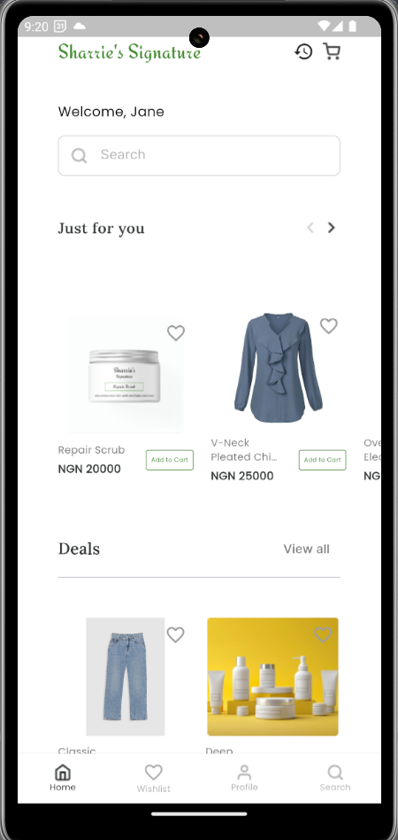
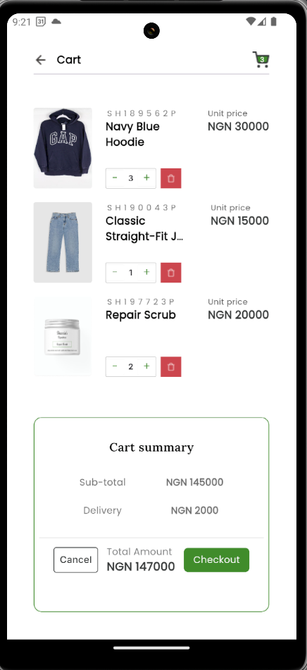

# Sharrie's Signature E-commerce App

## Overview

Sharrie's Signature E-commerce App is a comprehensive shopping application designed to provide users with a seamless online shopping experience. The app includes features such as product search, category-based browsing, product details, and a shopping cart.

## Features

- Product Search: Search for products using keywords.
- Category Browsing: Browse products by categories
- Product Details: View detailed information about each product.
- Shopping Cart: Add, remove, and manage products in your cart.
- Order History: View past orders.

## Setup Instructions

### Prerequisites

- Install [Flutter SDK](https://flutter.dev/docs/get-started/install)
- Install [Android Studio](https://developer.android.com/studio) or [Xcode](https://developer.apple.com/xcode/) for iOS development.
- Create an account on [Timbu](https://timbu.cloud). Get your API key. Add some products information on your timbu account under Retail Business. Go through the [Timbu API documentation](https://docs.timbu.cloud/api/intro) to understand the implementation.

1. **Clone the Repository**

   ```sh
   git clone https://github.com/ogunkapc/Timbu-V2
   cd timbu
   ```

2. **Add your Timbu API key**

    - Create a keys.dart file in the lib directory with the following content:

    ```dart
    class ApiKeys {
        static const String apiKey = 'your_api_key';
        static const String appId = 'your_app_id';
        static const String orgId = 'your_org_id';
    }
    ```

    - Ensure `keys.dart` is added to .gitignore to avoid exposing your keys.

3. **Install dependencies**

    ```sh
    flutter pub get
    ```

4. **Run the app**

    ```sh
    flutter run
    ```

## App Screenshots

 &nbsp;&nbsp;&nbsp;&nbsp;&nbsp;&nbsp;&nbsp;&nbsp; 

&nbsp;&nbsp;&nbsp;&nbsp;&nbsp;&nbsp;&nbsp;&nbsp;&nbsp;&nbsp;&nbsp;&nbsp;&nbsp;&nbsp;&nbsp;&nbsp;
&nbsp;&nbsp;&nbsp;&nbsp;&nbsp;&nbsp;&nbsp;&nbsp;&nbsp;&nbsp;&nbsp;&nbsp;&nbsp;&nbsp;&nbsp;&nbsp;
&nbsp;&nbsp;&nbsp;&nbsp;&nbsp;&nbsp;&nbsp;&nbsp;&nbsp;&nbsp;&nbsp;&nbsp;&nbsp;&nbsp;&nbsp;&nbsp;


## Download

[APK Download link](https://drive.google.com/drive/folders/1IFKPAa4M6OrbsSIlE-z4sPetfJvKmXt7?usp=sharing)
